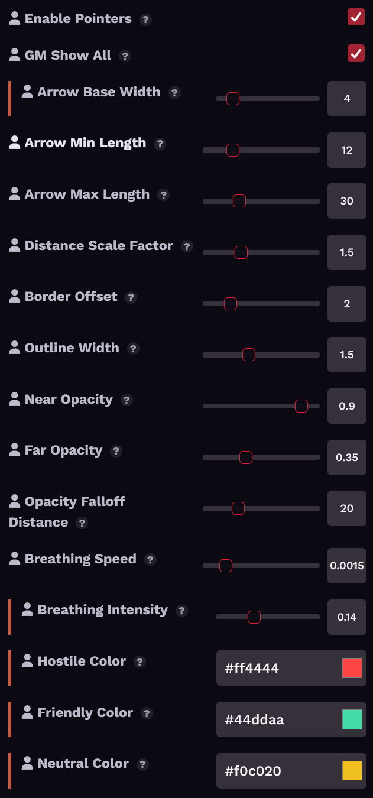

# Corn's Target Direction Pointer

A [Foundry VTT](https://foundryvtt.com/) module that draws directional arrows on the border of your token pointing toward each of your targets.


> **Note:** Module contains no AI-generated art or game content. I came up with the idea and guided the design decisions; [Claude](https://claude.ai) (Anthropic) assisted with the code, settings, and documentation.


## Features

- **Directional arrows** on your token's border, one per target
- **Relationship-based coloring**: red for hostile ↔ friendly, teal for friendly ↔ friendly, yellow for hostile ↔ hostile or ambiguous
- **Arrow width scales** with source token size
- **Arrow length scales** with distance to target
- **Opacity falloff** — distant targets fade out
- **Self-target indicator** — a centered ring when targeting your own token
- **GM "show all" mode** — see targeting arrows on every connected player's character token
- **Subtle breathing animation** — gentle pulse (configurable or disable)
- **Visibility aware** — no arrows on tokens you cannot see, including tokens on a Scene Level that is not currently displayed (Foundry v14)
- **Keyboard toggle** — no default binding; assignable in Configure Controls
- **Fully configurable** — every parameter adjustable in Module Settings


*Hostile token targeting friendly and hostile tokens. Red toward friendlies, yellow toward the other hostile.*


*GM view with "Show All" enabled. Arrows visible on multiple tokens at once.*

## Installation

### Manifest URL (recommended)

1. In Foundry VTT, go to **Add-on Modules** → **Install Module**
2. Paste this URL into the **Manifest URL** field:
   ```
   https://github.com/miniaturepancake/foundryvtt-corns-target-direction-pointer/releases/latest/download/module.json
   ```
3. Click **Install**

### Manual

1. Download `module.zip` from [Releases](https://github.com/miniaturepancake/foundryvtt-corns-target-direction-pointer/releases)
2. Extract to `<FoundryData>/Data/modules/target-direction-pointer/`
3. Restart Foundry and enable the module in your world

## Settings

All settings are per-client, so each player tunes their own view.



| Setting | Default | Range | Description |
|---|---|---|---|
| Enable Pointers | ✓ | — | Master toggle |
| GM Show All | ✓ | — | GM sees targeting arrows on every connected player's assigned character token |
| Arrow Base Width | 6 | 2–20 | Half-width of the arrow base, in pixels at 1×1 token scale |
| Arrow Min Length | 12 | 4–40 | Minimum arrow length in pixels |
| Arrow Max Length | 30 | 10–80 | Maximum arrow length, scaled by token size |
| Distance Scale Factor | 1.5 | 0–5 | Arrow growth per grid-unit of distance |
| Border Offset | 2 | 0–10 | Gap between the token edge and the arrow base |
| Outline Width | 1.5 | 0–4 | Dark outline around arrows |
| Near Opacity | 0.90 | 0.1–1 | Opacity for the nearest targets |
| Far Opacity | 0.35 | 0–1 | Opacity floor for the most distant targets |
| Opacity Falloff Distance | 20 | 5–60 | Grid-units over which opacity decays from near to far |
| Breathing Speed | 0.0015 | 0–0.01 | Pulse speed; 0 disables the animation |
| Breathing Intensity | 0.12 | 0–0.4 | Pulse depth; 0 disables the animation |
| Hostile Color | #ff4444 | — | Cross-disposition targeting |
| Friendly Color | #44ddaa | — | Friendly-to-friendly targeting |
| Neutral Color | #f0c020 | — | Same-hostile or ambiguous targeting |

The three color settings use Foundry's native color picker.

**GM Show All** relies on each player having a character assigned in their user
configuration — a player with no assigned character produces no arrows for the
GM. The GM's own targets always draw on whatever tokens the GM controls.

## Color Logic

| Source → Target | Color | Reasoning |
|---|---|---|
| Hostile → Friendly | Red | Combat intent |
| Friendly → Hostile | Red | Combat intent |
| Friendly → Friendly | Teal | Support / buff / heal |
| Hostile → Hostile | Yellow | Ambiguous |
| Anything with Neutral/Secret | Yellow | Ambiguous |

## Compatibility

- **Foundry VTT**: v13 and v14 (verified against 14.367)
- **Systems**: System-agnostic
- **Conflicts**: None known

Version history and release notes are on the
[Releases page](https://github.com/miniaturepancake/foundryvtt-corns-target-direction-pointer/releases).

## License

[MIT](LICENSE)
